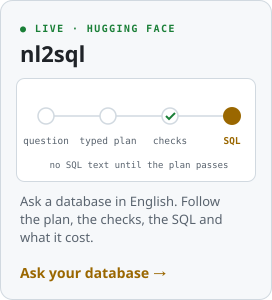
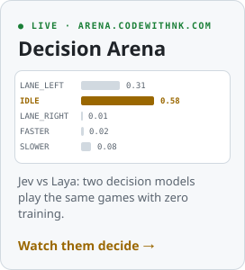
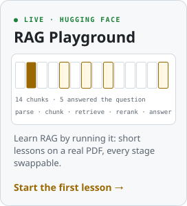

  <picture>
    <source media="(prefers-color-scheme: dark)" srcset="assets/header-dark.svg">
    <source media="(prefers-color-scheme: light)" srcset="assets/header-light.svg">
    
  </picture>

  
  
  
  
  
  

---

## 🚀 What I'm Building

<!-- PROJECTS:START -->
**Try it live**

<a href="https://nadeem4nk-nl2sql-demo.hf.space/"><picture><source media="(prefers-color-scheme: dark)" srcset="assets/projects/nl2sql-dark.svg"></picture></a>
<a href="https://arena.codewithnk.com/"><picture><source media="(prefers-color-scheme: dark)" srcset="assets/projects/jev-demo-dark.svg"></picture></a>
<a href="https://nadeem4nk-rag-playground.hf.space"><picture><source media="(prefers-color-scheme: dark)" srcset="assets/projects/rag-playground-dark.svg"></picture></a>

**In progress**

<a href="https://github.com/nadeem4/logscribe"><picture><source media="(prefers-color-scheme: dark)" srcset="assets/projects/row-logscribe-dark.svg"></picture></a> 
<a href="https://github.com/nadeem4/medalflow"><picture><source media="(prefers-color-scheme: dark)" srcset="assets/projects/row-medalflow-dark.svg"></picture></a> 
<a href="https://github.com/nadeem4/post_training"><picture><source media="(prefers-color-scheme: dark)" srcset="assets/projects/row-post_training-dark.svg"></picture></a>

<!-- PROJECTS:END -->

<b>Earlier work that people still use</b>

 

| Project | Why it exists |
| :--- | :--- |
| **[microservice_demo](https://github.com/nadeem4/microservice_demo)** | A clean, minimal Spring Boot microservice reference — the version I wanted when I was learning the pattern. |
| **[spring_boot_multi_module_framework](https://github.com/nadeem4/spring_boot_multi_module_framework)** | Bootstraps a multi-module Spring Boot project so teams skip the first week of scaffolding. |
| **[chess_engine_using_python](https://github.com/nadeem4/chess_engine_using_python)** | Minimax, alpha-beta pruning, and quiescence search, written to be read rather than to win. |
| **[mini-gpt](https://github.com/nadeem4/mini-gpt)** | A decoder-only Transformer in pure PyTorch, stripped to the pieces that actually matter. |
| **[aurora](https://github.com/nadeem4/aurora)** | Semantic search engine on FastAPI and Sentence Transformers. |

---

## 📈 Impact

- Cut cloud spend **~30%** through architecture and execution-path optimization
- Reduced engineer onboarding from **months to weeks** via platform automation
- Delivered **end-to-end AI and data platforms** with explicit reliability guarantees
- Consistent bias toward **correctness, observability, and system clarity**

---

## 🧠 Technical Focus

  <b>Languages &amp; Frameworks</b> 
  Python · Java · TypeScript · Spring · Node.js · Next.js · FastAPI · PyTorch · Angular 
  <picture>
    <source media="(prefers-color-scheme: dark)" srcset="https://skillicons.dev/icons?i=python%2Cjava%2Cts%2Cspring%2Cnodejs%2Cnextjs%2Cfastapi%2Cpytorch%2Cangular&theme=dark">
    
  </picture>

  <b>Platform &amp; Infrastructure</b> 
  Kubernetes · Docker · Azure · GitHub Actions · Postgres · Grafana · Git · Linux 
  <picture>
    <source media="(prefers-color-scheme: dark)" srcset="https://skillicons.dev/icons?i=kubernetes%2Cdocker%2Cazure%2Cgithubactions%2Cpostgres%2Cgrafana%2Cgit%2Clinux&theme=dark">
    
  </picture>

**AI Systems** — LLM inference efficiency · agentic systems · RAG & vector search · retrieval evaluation · execution feedback loops · cost/latency tradeoffs · agent safety

**Platform & Distributed Systems** — serverless · CI/CD · observability · private networking · fault tolerance

**Data Systems** — ETL platforms · lakehouse architectures · Apache Spark · SQL engines · cost optimization

<b>How I think about each of these</b>

 

**AI Systems.** The interesting problems are not in the model, they are around it: making a non-deterministic component behave predictably inside a system that has to be correct. Retrieval quality, validation layers, execution feedback, and hard safety constraints do more for output quality than prompt tuning does. Inference cost and latency are design inputs, not afterthoughts.

**Platform & Distributed Systems.** A platform succeeds when it makes the right thing the easy thing. Most of the value is in defaults, guardrails, and paved roads — not features. Failure modes should be boring and well-understood before traffic arrives.

**Data Systems.** Lineage and reproducibility beat cleverness. A pipeline you can explain, replay, and cost-attribute is worth more than a faster one you cannot reason about.

---

## ✍️ Latest Writing

<!-- BLOG-POST-LIST:START -->
- [Decision Models: How Jev and Laya Decide Without Writing Text](https://medium.com/learnwithnk/decision-models-how-jev-and-laya-decide-without-writing-text-df1cbe852aa1) &nbsp;Sep 24, 2026
- [I Tested Jev and Laya, Two New AI Decision Models, on Games They Were Never Trained For](https://medium.com/learnwithnk/i-tested-jev-and-laya-two-new-ai-decision-models-on-games-they-were-never-trained-for-d839992b75c0) &nbsp;Sep 24, 2026
- [Shapes, FLOPs, and Memory: Sizing a Transformer Before You Run It](https://medium.com/learnwithnk/shapes-flops-and-memory-sizing-a-transformer-before-you-run-it-b7b2beca4f4a) &nbsp;Sep 20, 2026
- [The Ingestion Pipeline: What You Ingest, What You Store, and What Starts the Rest](https://medium.com/learnwithnk/the-ingestion-pipeline-what-you-ingest-what-you-store-and-what-starts-the-rest-ed227b608b68) &nbsp;Sep 19, 2026
- [A Baseline RAG and a Golden Set Before Any Optimisation](https://medium.com/learnwithnk/a-baseline-rag-and-a-golden-set-before-any-optimisation-c0c45de5847b) &nbsp;Sep 18, 2026<!-- BLOG-POST-LIST:END -->

More at **[medium.com/learnwithnk](https://medium.com/learnwithnk)** · **[codewithnk.com](https://codewithnk.com/)**

---

## 📊 GitHub

  <picture>
    <source media="(prefers-color-scheme: dark)" srcset="https://streak-stats.demolab.com/?user=nadeem4&theme=dark&hide_border=true&date_format=M%20j%5B%2C%20Y%5D">
    
  </picture>

  <picture>
    <source media="(prefers-color-scheme: dark)" srcset="https://github-profile-summary-cards.vercel.app/api/cards/repos-per-language?username=nadeem4&theme=github_dark">
    
  </picture>
  <picture>
    <source media="(prefers-color-scheme: dark)" srcset="https://github-profile-summary-cards.vercel.app/api/cards/most-commit-language?username=nadeem4&theme=github_dark">
    
  </picture>

---

## 🧩 Engineering Philosophy

- Determinism before scale
- Observability before optimization
- Clear interfaces enable fast, safe systems
- Prefer boring, reliable systems over clever hacks

---

  Reach me at <a href="mailto:codewithnk@gmail.com">codewithnk@gmail.com</a>

