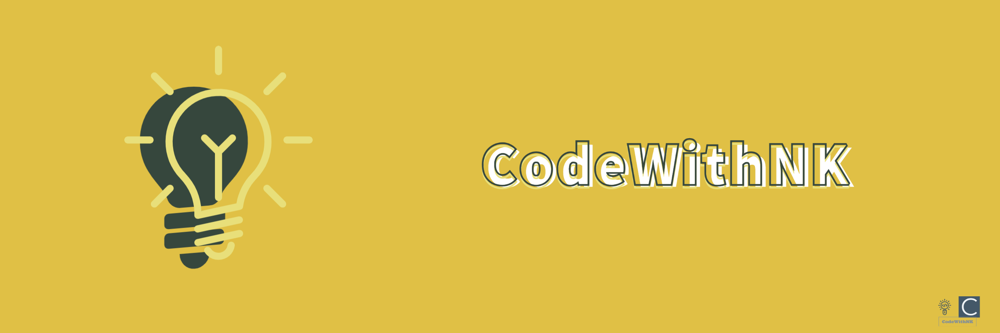

<h2 align='center'><samp><strong>Nadeem Khan (@codewithnk)</strong> 👋</samp></h2>

   
   
  

 
 

 
 

<h2 align="center" style="margin: 5px 10px;"><samp><strong>GitHub Stats:</strong> </samp></h2> 
 
  

 
 

<h2 align="center"><samp><strong>Contribution Graph:</strong> </samp></h2>

 
 

  <h2 align="center"><samp><strong>Skills</strong> </samp></h2>

 
 

<h2 align="center"><samp><strong>Connect with me:</strong> </samp></h2>

